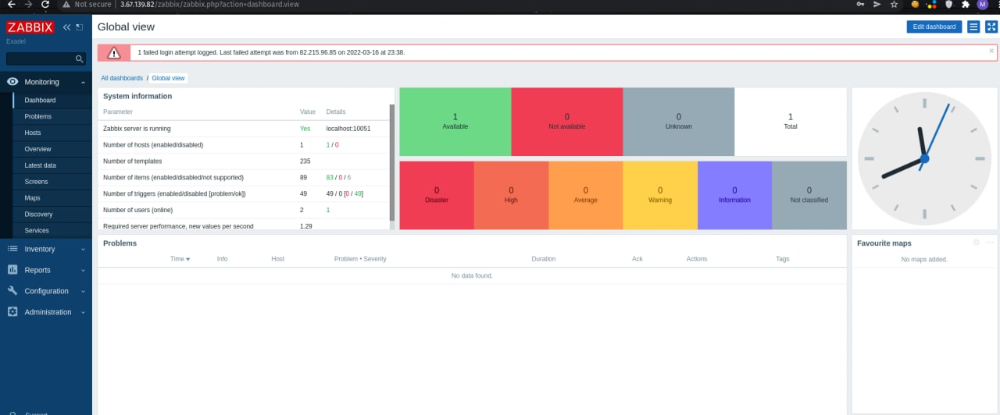

#### Active Agent(outgoing connections to zabbix server) is run on 10051/TCP & Passive Agent(incomming connections to zabbix server) on 10050/TCP.
#### Active Agent know which configurations | items do it need to monitor by connecting server.
#### Passive Agent, Zabbix Server(pooler) connect to an agent & request metrix & wait for response, get response and close connections.

-----
#### Maintenance Periods can be defined for hosts group and specific services etc in Zabbix
Data Collection and No Data Collection 